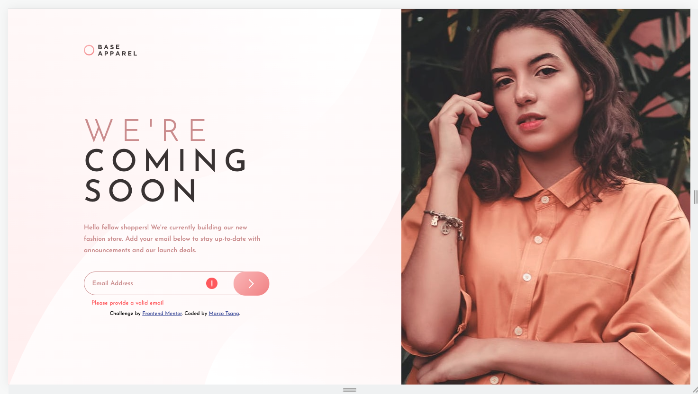
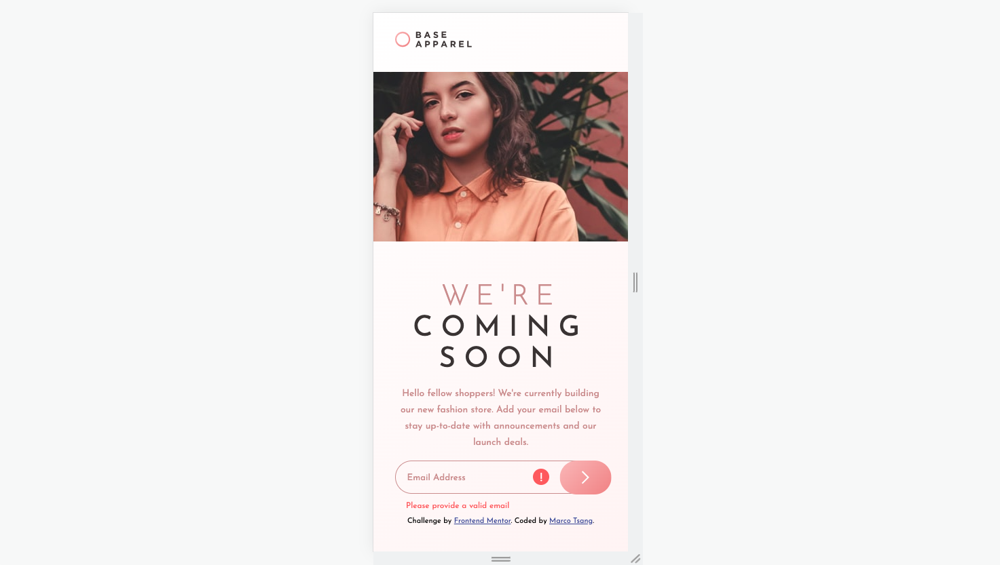

# Frontend Mentor - Base Apparel coming soon page solution

This is a solution to the [Base Apparel coming soon page challenge on Frontend Mentor](https://www.frontendmentor.io/challenges/base-apparel-coming-soon-page-5d46b47f8db8a7063f9331a0). Frontend Mentor challenges help you improve your coding skills by building realistic projects.

## Table of contents

- [Overview](#overview)
  - [The challenge](#the-challenge)
  - [Screenshot](#screenshot)
  - [Links](#links)
- [My process](#my-process)
  - [Built with](#built-with)
  - [What I learned](#what-i-learned)
  - [Continued development](#continued-development)
  - [Useful resources](#useful-resources)
- [Author](#author)

## Overview

### The challenge

Users should be able to:

- View the optimal layout for the site depending on their device's screen size
- See hover states for all interactive elements on the page
- Receive an error message when the `form` is submitted if:
  - The `input` field is empty
  - The email address is not formatted correctly

### Screenshot




### Links

- Solution URL: [Solution URL here](https://github.com/hkmarcoot/fementor-base-apparel-coming-soon-master)
- Live Site URL: [Live site URL here](https://hkmarcoot.github.io/fementor-base-apparel-coming-soon-master/)

## My process

### Built with

- Semantic HTML5 markup
- CSS custom properties
- Flexbox
- Mobile-first workflow

### What I learned

- Email validation using regex.
- Positioning by adding button & label relative to form input.

```js
function isEmail(input) {
  return /^\w+([\.-]?\w+)*@\w+([\.-]?\w+)*(\.\w{2,3})+$/.test(input);
}
```

### Continued development

The email validation only checks when pressing the submit button or enter key. It needs to be checked real time when the user is typing.

### Useful resources

- [Resource 1](https://www.w3resource.com/javascript/form/email-validation.php) - This helped me for email validation.

## Author

- Website - [Marco Tsang](https://www.linkedin.com/in/marco-tsang112)
- Frontend Mentor - [@hkmarcoot](https://www.frontendmentor.io/profile/hkmarcoot)
- Twitter - [@marcotsang112](https://www.twitter.com/marcotsang112)
